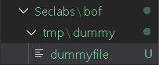
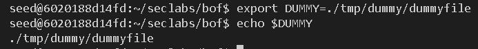
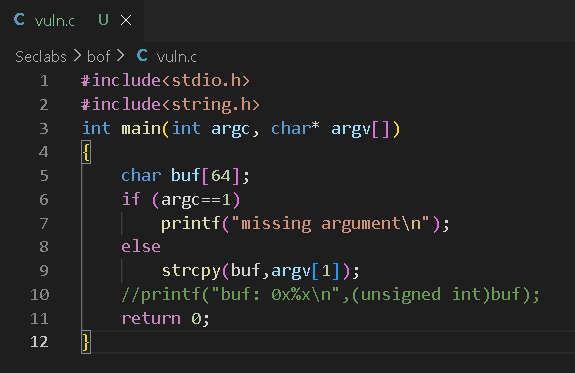
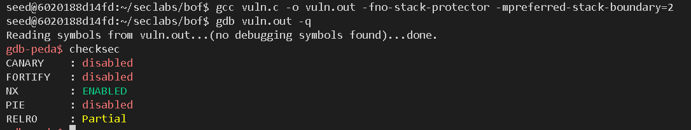
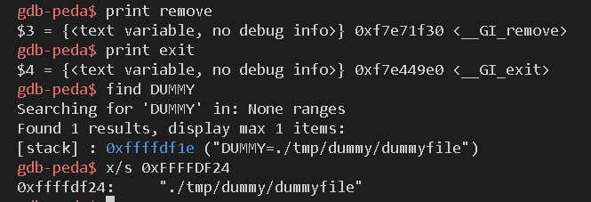
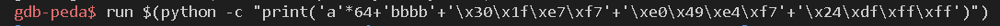
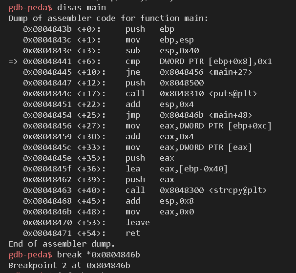
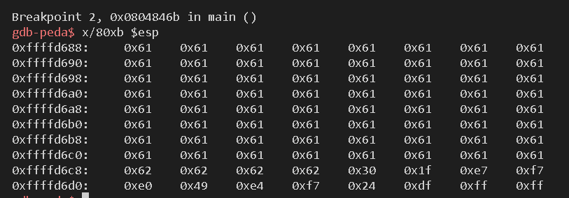
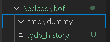

**Student: Duong Duc Khai**  
**ID: 21110775**

# Lab 3 - Delete file using return-to-libc attack with environment variable

<h2>1. Set up dummyfile directory</h2>

<h2>2. Set environment variable for dummyfile path</h2>

 
<h2>3. Analyze vuln.c stack frame for function main</h2>

 
The function main takes in 2 parameters: int argc, char* argv[], and it has a local variable: char buf[64], the analyzed stack frame is:  

 
We want to start buffer overflow from variable buf, overwrite eip with the function remove's address, following by the function exit's address and the dummyfile environment variable's address.  
<h2>4. Compile and start gdb</h2>

I turned on the NX bit here so stack is not executable, we're forced to use exploits such as return-to-libc to attack the program.
<h2>5. Find addresses of remove, exit, and dummyfile envrionment variable</h2>

Because I need the value from the dummyfile env varaible only, I incremented the addresses by 6 to remove "DUMMY=". Therefore, when we pass in the address 0xffffdf1e, we should get "./tmp/dummy/dummyfile" as our value.  
<h2>6. Conduct attack</h2>
exit - 0xf7e449e0 -> \xe0\x49\xe4\xf7  
remove - 0xf7e71f30 -> \x30\x1f\xe7\xf7  
DUMMY - 0xffffdf1e ->  \x1f\xdf\xff\xff  
&DUMMY+6 = FFFFDF24 -> \x24\xdf\xff\xff  
Now I have had all the required information for the attack. The snippet I passed in the program was as the following:

I added a break point so I can check if the stack frame was correct after I ran the program with a vunerable snippet.

We could see that the first 64 bytes of the stack frame is the letter 'a' or 61 in hex following by 4 bytes of the letter 'b' or 62 in hex. The next 3 next 4 bytes were the addresses of remove, exit, and DUMMY respectively.

I resumed the program and the dummyfile has been deleted.  

