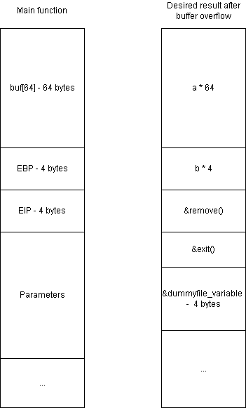

**Student: Duong Duc Khai**
**ID: 21110775**

# Lab 3 - Delete file using return-to-libc attack with environment variable

1. Set up dummyfile directory  

2. Set environment variable for dummyfile path  

3. Analyze vuln.c stack frame for function main  

 
The function main takes in 2 parameters: int argc, char* argv[], and it has a local variable: char buf[64], the analyzed stack frame is:  

We want to start buffer overflow from variable buf, overwrite eip with the function remove's address, following by the function exit's address and the dummyfile environment variable's address.  
4. Compile and start gdb   

I turned on the NX bit here so stack is not executable, we're forced to use exploits such as return-to-libc to attack the program.
6. Find addresses of remove, exit, and dummyfile envrionment variable   

Because I need the value from the dummyfile env varaible only, I incremented the addresses by 6 to remove "DUMMY=". Therefore, when we pass in the address 0xffffdf1e, we should get "./tmp/dummy/dummyfile" as our value.  
8. Conduct attack  
exit - 0xf7e449e0 -> \xe0\x49\xe4\xf7  
remove - 0xf7e71f30 -> \x30\x1f\xe7\xf7  
DUMMY - 0xffffdf1e ->  \x1f\xdf\xff\xff  
&DUMMY+6 = FFFFDF24 -> \x24\xdf\xff\xff  
Now I have had all the required information for the attack.   
  
I added a break point so I can check if the stack frame is correct after I run the program with a vunerable snippet.
  
  
We can see that the first 64 bytes of the stack frame is the letter 'a' or 61 in hex following by 4 bytes of the letter 'b' or 62 in hex. The next 3 next 4 bytes are the addresses of remove, exit, and DUMMY respectively.
I resumed the program and the dummyfile is deleted.  

